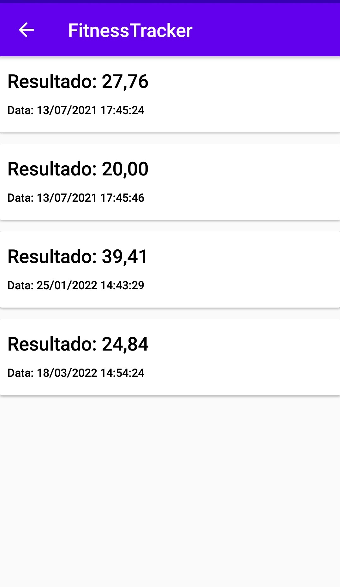
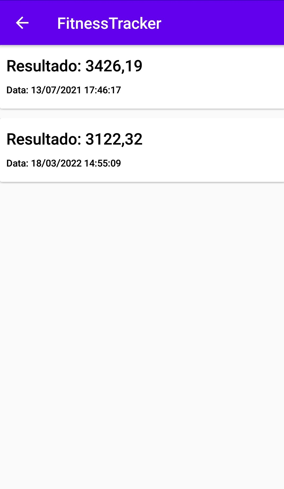
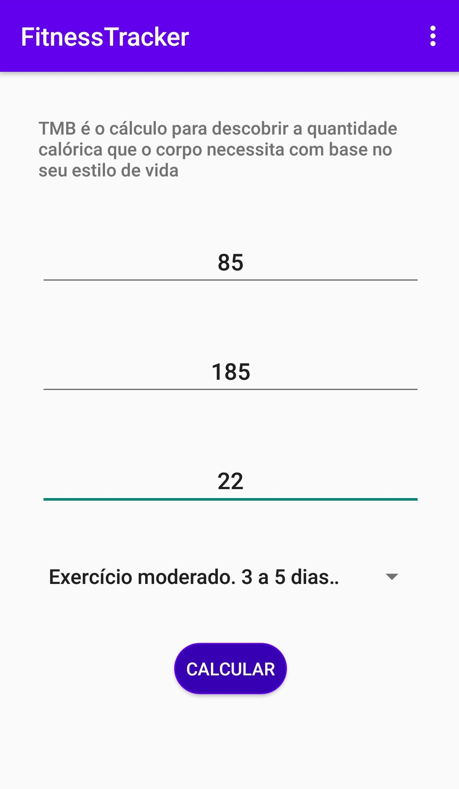
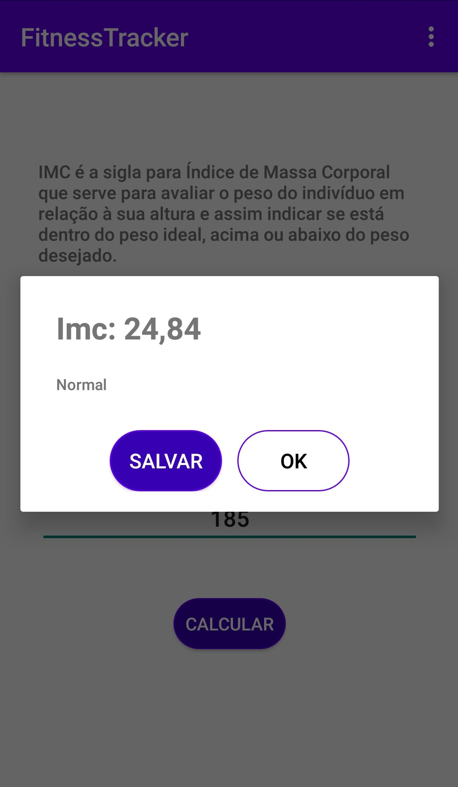

# Simples Calculadora de IMC e TMB

Aplicativo que calcula e mostra o **Indice de Massa Corporal (IMC)** e **Taxa de Metabolismo Basal (TMB)**. Esse projeto foi desenvolvido durante o [Curso Android Express](https://androiddeveloper.com.br/inscricao). 

# Tecnologias

- [Kotlin](https://kotlinlang.org/)
- [SQLite](https://www.sqlite.org/index.html)

# Projeto

